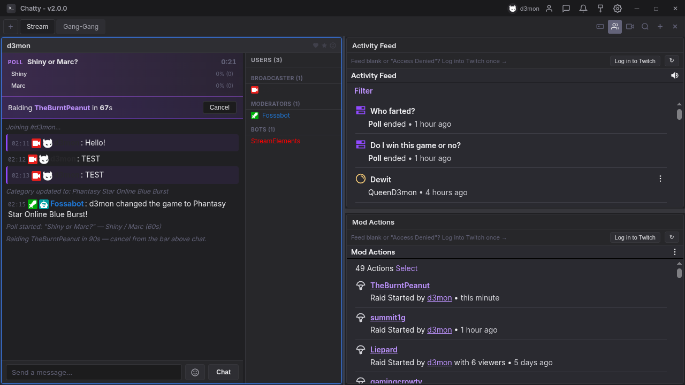

# Chatty



**A Twitch chat client for streamers, with OBS overlays built in.**

Chatty is a desktop chat client for Windows and Linux. It puts every channel you
care about in one window, gives you the moderation tools you would otherwise go
to the Twitch site for, and doubles as the alert and chat overlay system for your
stream — so you are not running a separate browser-source service alongside it.

It also runs **your own Discord bot**, with your own keys, joining the two sides
together: watching and chatting on Twitch earns points, levels and achievements
that your viewers see in Discord.

[**Download the latest release →**](../../releases/latest)

---

## What it does

### Chat

- **Multi-pane** — split the window into as many channels as you want, across
  tabs, in whatever arrangement suits you. Your layout comes back after a restart.
- **Every emote** — Twitch, BTTV, FFZ and 7TV, in chat and in an emote picker
  that lists everything your account can actually type, grouped per channel.
- **Badges and name colours** exactly as they appear on Twitch.
- **Whispers** in a dockable panel, with whispers mirrored into your own channel
  so you notice them mid-stream.
- **Notification sounds** for mentions and whispers — two soft cues, one rising,
  one falling, so you can tell them apart without looking. Off-switchable.
- **Chat logs** written to disk per channel, if you want them.

### Streaming and moderation

- **Full slash commands** — `/ban`, `/timeout`, `/mod`, `/vip`, `/raid`,
  `/announce`, `/settitle`, `/setgame`, `/marker`, `/shoutout` and more, with
  autocomplete.
- **`/poll`** — start a poll without leaving the app, and watch it fill in on a
  banner above chat with live vote counts, bars and a countdown.
- **Raid banner** — who you are raiding, how long is left, and a Cancel button.
- **Activity Feed and Mod Actions** panels, embedded and always current.
- **User cards** with a viewer's history in your channel.

### OBS overlays

Chatty runs a small local server and hands you three browser-source URLs. No
account anywhere else, no subscription, nothing leaves your machine.

- **Alerts** — a bar that slides in for follows, subs, resubs, gifted subs,
  cheers and raids, with per-type text, colours and hold times. Bring your own
  sound for any alert type, or use the built-in cue.
- **Chat overlay** — your chat on stream, with badges, real name colours and
  emotes. Optional transparent background box with adjustable colour, opacity,
  corner radius and padding for when chat sits over bright gameplay.
- **Event glow** — the chat overlay blooms in the colour of whatever just
  happened: sky blue for a follow, violet for subs, pink for gifted subs, amber
  for bits, rose for a raid, orange for a hype train. Every colour is yours to
  change, and the whole thing has an off switch.
- **Trigger Board** — fire your own sounds and clips on stream from a grid.

Overlays reload themselves when the app is updated, so an OBS source can never
sit there serving a stale page after an upgrade.

### Your Discord bot

Chatty runs a bot you create yourself, with your own token. Nothing is shared
with anyone, no third-party service sits in the middle, and the token is
encrypted with your operating system's keychain. Setting it up is four steps in
Settings, including a button that builds the invite link for you.

- **Going live** — a card in Discord the moment your stream starts, with the
  preview image, box art, category and viewer count. It can keep the count fresh
  while you are live, then either grey itself out or delete itself when you stop.
  Write your own message above it, with `{name}`, `{game}`, `{viewers}` and
  `{everyone}`.
- **Temporary voice channels** — someone joins a lobby and gets their own
  channel, which they own. Thirteen `/voice-*` commands: rename, limit, lock,
  unlock, hide, reveal, kick, ban, unban, transfer, claim, owner and clean. If
  the owner leaves, whoever has been in there longest takes over; when the last
  person leaves, the channel goes with them.
- **Levels and XP**, earned from Twitch chat and watch time as well as Discord
  messages and voice. `/rank` and `/levels`.
- **Points**, earned on Twitch and spent in Discord. Viewers run `/link` once to
  join their accounts — anything they earned watching beforehand is kept and
  merged, not thrown away.
- **Achievements**, single or tiered, counting anything from bits cheered to
  minutes watched. Your own icons, your own unlock messages, and a points reward
  if you want one.
- **Birthdays** — people set theirs with `/birthday`, and the bot says so on the
  day at an hour you choose.
- **Welcome and goodbye** messages, as plain text or a card, with an optional
  direct message to new members.
- **Polls** built on Discord's own poll object — real vote tracking, a proper
  countdown and a real close, rather than counting reactions.
- **Custom commands** with variables, randomness and conditions
  (`{if {balance} >= 100}rich{else}skint{/if}`), published as real slash commands
  with cooldowns and an optional price in points.

**Run it on a server if you want it always online.** The bot is only up while
Chatty is, which suits go-live alerts but not temporary voice channels at three
in the morning. *Export the bot…* writes a small Node project — the same code,
your settings, and your members' balances and levels — that runs anywhere Node
does, with one dependency and a systemd unit included. Your token is not written
into it; the bot reads it from an environment variable instead.

---

## Install

### Windows

Download **`Chatty-Setup.exe`** from the
[latest release](../../releases/latest) and run it. You can choose the install
location. Chatty will offer to update itself from here when a new version lands.

### Linux

Download **`Chatty.AppImage`**, make it executable, and run it:

```bash
chmod +x Chatty.AppImage
./Chatty.AppImage
```

No installation, no package manager, no dependencies to chase — an AppImage is
a single self-contained file that runs on any modern distribution.

Chatty updates itself from this page: when a new version is out it downloads
the new AppImage and replaces itself in place. Keep it somewhere you can write
to (your home folder is ideal) so it can do that.

---

## Setting up the Discord bot

1. Create an application at [discord.com/developers](https://discord.com/developers/applications),
   open **Bot**, press **Reset Token** and copy it.
2. In Chatty: **Settings → Streamer Tools → Discord**. Paste the token, add the
   Application ID, then press **Invite the bot** — it opens Discord with the right
   permissions already ticked and notices by itself once the bot is in.
3. Pick your server. The slash commands publish themselves.

Only **welcome and goodbye messages** need a privileged intent (Server Members),
and Chatty only asks for it when you switch that feature on. Everything else
works with no portal toggles at all.

---

## About this repository

This repository hosts **release builds and this README only** — there is no
source code here. Chatty is developed privately.

Made by **d3mon** — [d3mon.gg](https://d3mon.gg)

If Chatty is useful to you, consider creating an account on
[d3mon.gg](https://d3mon.gg) and subscribing from your
[account settings](https://d3mon.gg/account/subscription).
